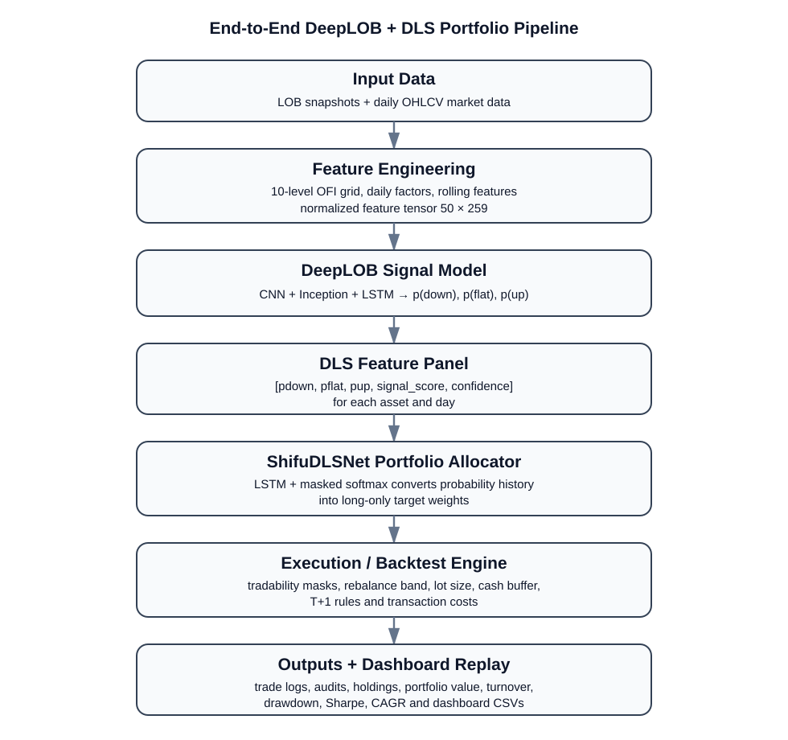
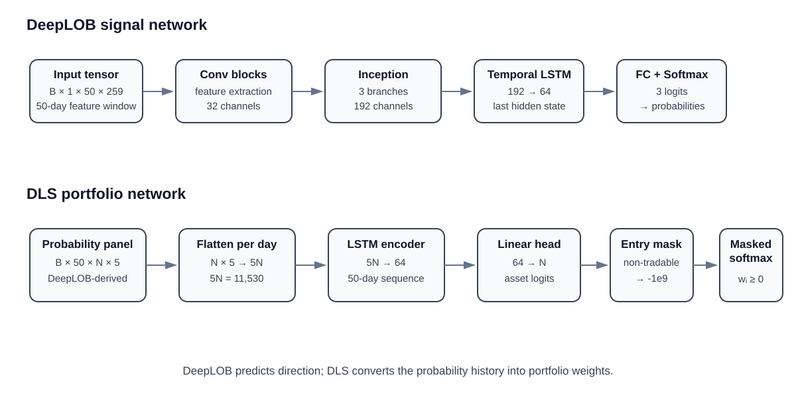
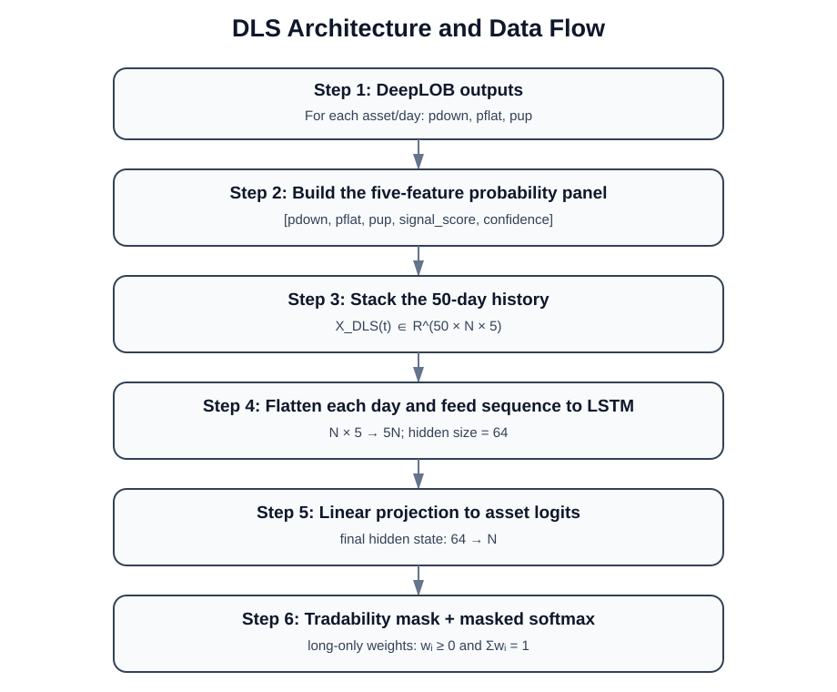
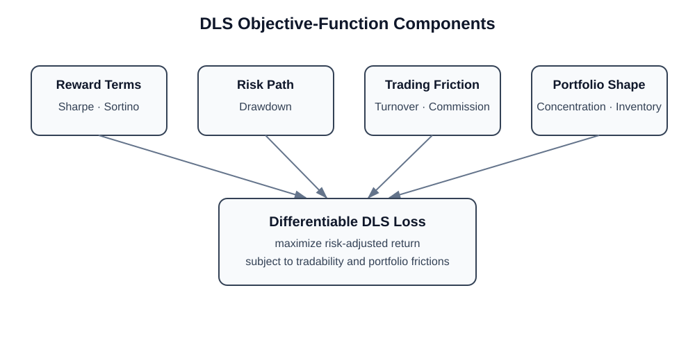
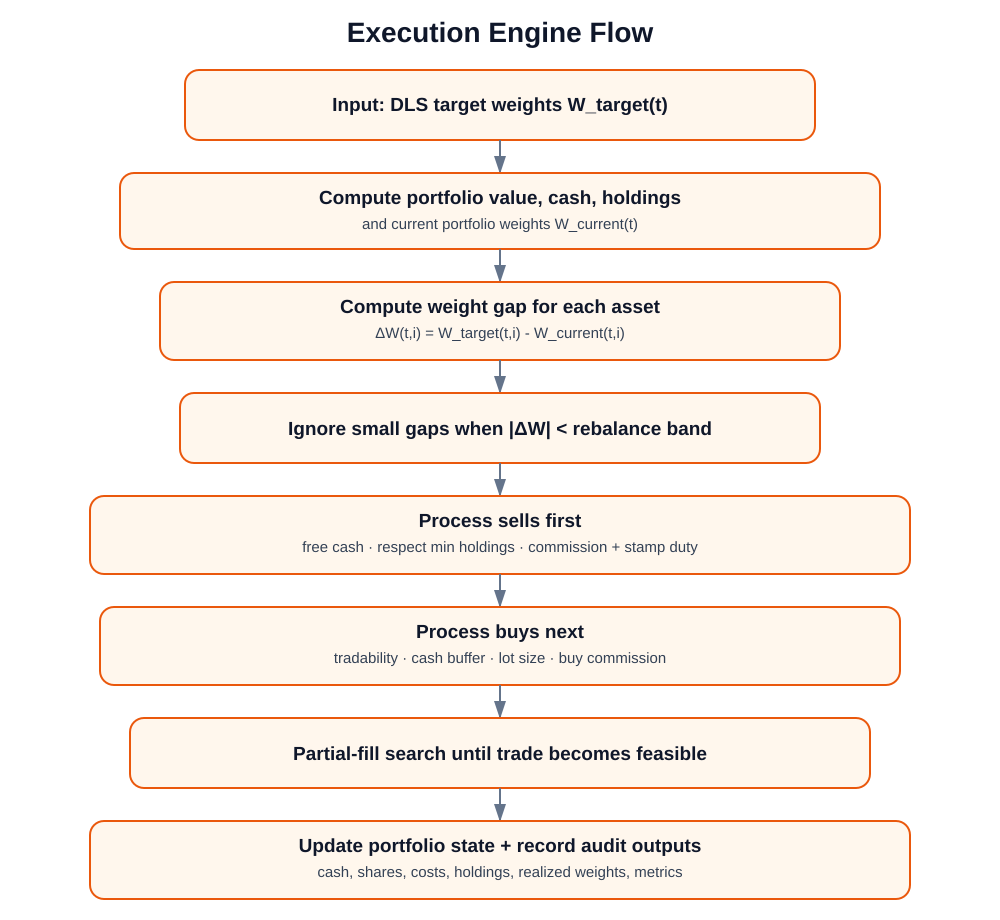
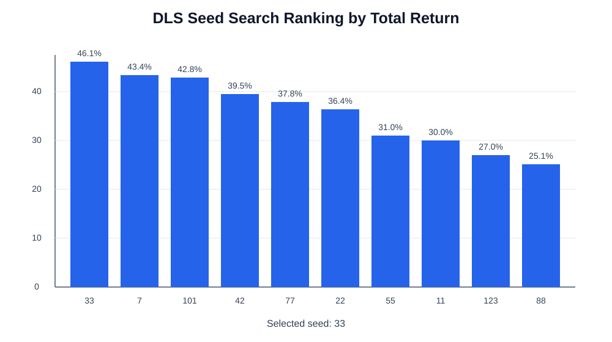
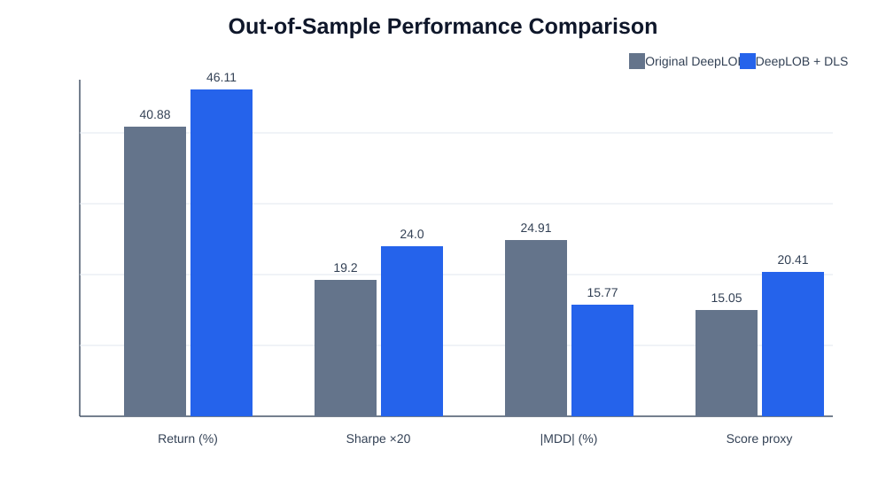
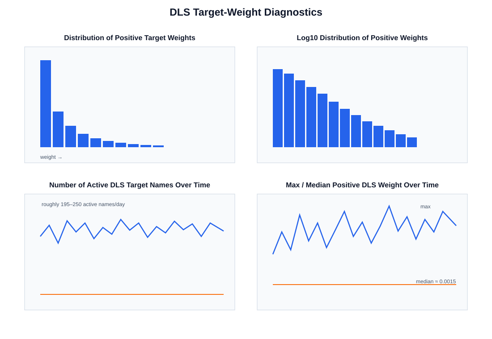

<div align="center">

# DeepLOB + DLS Asset Allocation

### From limit-order-book prediction to portfolio allocation, execution, audit, and interactive replay

**DeepLOB signals → DLS portfolio weights → realistic execution → auditable trading-engine replay**

</div>

---

## Overview

This repository contains a complete **research-to-execution asset-allocation workflow** built on top of DeepLOB market signals.

The project separates the trading problem into four explicit layers:

1. **Market representation** — causal LOB/OFI and OHLCV feature engineering.
2. **Signal generation** — a pretrained DeepLOB network produces three-class directional probabilities for each asset.
3. **Portfolio construction** — a Deep Learning Sharpe (DLS) allocator transforms those signals into cross-sectional target weights.
4. **Execution and audit** — desired allocations are converted into feasible orders, fills, holdings, portfolio metrics, detailed audit files, and an interactive Streamlit replay application.

The central design idea is that **prediction and capital allocation are different problems**.

DeepLOB answers:

> What does the model believe may happen to this asset?

DLS answers:

> Given all asset-level signals and their recent history, how should capital be distributed across the available universe?

The execution layer then answers:

> Which desired portfolio changes can actually be implemented under tradability, cash, lot-size, rebalance, and transaction-cost constraints?

This decomposition keeps the entire decision chain inspectable:

```text
market data
→ features
→ model probabilities
→ signal quality
→ target weights
→ submitted orders
→ filled trades
→ holdings
→ portfolio performance
```

---

## Key Results

Latest documented executed run:

| Metric | DeepLOB + DLS |
|---|---:|
| Initial capital | **RMB 50,000,000** |
| OOS period | **D485–D726** |
| OOS trading days | **242** |
| Selected DLS seed | **33** |
| Final portfolio value | **≈ RMB 73.05M** |
| Total return | **46.11%** |
| Annualized Sharpe | **1.20** |
| Maximum drawdown | **−15.77%** |
| Score proxy | **20.41** |
| Average holdings/day | **235.3** |

### DeepLOB-only baseline vs. DeepLOB + DLS

| Metric | Base DeepLOB | DeepLOB + DLS |
|---|---:|---:|
| Total return | 40.88% | **46.11%** |
| Sharpe ratio | 0.96 | **1.20** |
| Maximum drawdown | −24.91% | **−15.77%** |
| Score proxy | 15.05 | **20.41** |
| Average holdings | 692.7 | **235.3** |
| Total trading costs | ≈ RMB 2.10M | ≈ RMB 3.08M |

In this documented run, the DLS allocation layer produced a **more selective portfolio**, improved return and Sharpe, and reduced maximum drawdown relative to the original DeepLOB-only exact baseline. The trade-off was a more active reallocation process and therefore higher transaction costs.

---

# End-to-End Pipeline

<p align="center">
  
</p>

The complete workflow is:

```text
Raw LOB + Daily OHLCV
        ↓
Causal Feature Engineering
        ↓
DeepLOB Input Tensor
        ↓
DeepLOB Directional Probabilities
        ↓
DLS Signal Feature Panel
        ↓
50-Day Cross-Sectional Sequence
        ↓
ShifuDLSNet Portfolio Allocator
        ↓
Tradability + Quality Filtering
        ↓
Target Portfolio Weights
        ↓
Execution / Backtest Engine
        ↓
Submitted Orders
        ↓
Executed Trades
        ↓
End-of-Day Holdings + Cash + PnL
        ↓
Metrics + Audit CSVs + Streamlit Replay
```

The important point is that each stage has its own responsibility. DeepLOB is not treated as a direct order generator, DLS is not assumed to be perfectly executable, and the backtest does not collapse target weights and realized holdings into the same object.

---

## Stage 1 — Market Data and Feature Engineering

The research workflow combines **limit-order-book information** with **daily OHLCV-derived variables**.

### LOB / OFI block

The LOB representation uses:

- 10 order-book levels;
- 24 intraday time slots;
- order-flow imbalance (OFI) features;
- causal rolling normalization based on historical information only.

The flattened intraday OFI representation contributes:

```text
24 time slots × 10 levels = 240 OFI features
```

### Daily market block

The daily block adds 19 variables, including:

- 1/5/10/20-day returns;
- 5-day and 20-day volatility;
- Amihud illiquidity;
- volume z-score;
- RSI;
- moving-average distance features;
- open-to-close return;
- high-low range;
- close-to-VWAP distance;
- raw open, close, volume, low, and high values.

The final feature width is therefore:

```text
240 LOB/OFI features + 19 daily features = 259 features
```

A rolling 50-day sequence is assembled into the DeepLOB tensor:

```text
B × 1 × 50 × 259
```

Feature preparation is deliberately causal so current or future information is not silently introduced into historical normalization statistics.

---

## Stage 2 — DeepLOB Signal Generation

DeepLOB acts as the **predictive signal layer**, not the portfolio allocator.

<p align="center">
  
</p>

The pretrained model combines convolutional feature extraction, an Inception-style block, a temporal LSTM, and a final classification head.

For every asset `i` and signal day `t`, the model produces:

```text
P(down), P(flat), P(up)
```

with:

```text
P(down) + P(flat) + P(up) = 1
```

These probabilities preserve more information than a single hard class label. Two assets may both be classified as bullish while having very different probability distributions and therefore very different signal quality.

---

## Stage 3 — DeepLOB Probabilities → DLS Features

The three DeepLOB probabilities are expanded into a five-dimensional representation.

Two derived variables are added:

```text
signal_score = P(up) - P(down)

confidence = |signal_score| × (1 - P(flat))
```

Each asset/day is represented as:

```text
[P(down), P(flat), P(up), signal_score, confidence]
```

| Feature | Interpretation |
|---|---|
| `P(down)` | bearish probability |
| `P(flat)` | neutral / low-direction probability |
| `P(up)` | bullish probability |
| `signal_score` | signed directional edge |
| `confidence` | directional strength after penalizing flatness |

This is the bridge between **classification** and **portfolio construction**.

---

## Stage 4 — DLS Temporal Input Construction

DLS does not use only the current day's probabilities. It consumes a **history of cross-sectional probability panels**.

<p align="center">
  
</p>

The documented universe contains:

```text
N = 2,306 assets
```

Each day therefore contains:

```text
2,306 × 5 = 11,530 signal values
```

The DLS allocator uses a 50-day lookback:

```text
50 × 2,306 × 5
```

At each temporal step, the cross-sectional asset-feature panel is flattened to `5N = 11,530`, creating a sequence for the DLS LSTM.

The allocator can therefore observe:

- changes in bullish and bearish probabilities;
- changes in confidence;
- shifts in the market-wide distribution of signals;
- persistence or reversal in recent signal structure;
- the relative opportunity set across thousands of assets.

---

## Stage 5 — ShifuDLSNet Portfolio Allocation

The documented DLS architecture uses:

```text
Input size       : 11,530
Temporal lookback: 50 days
LSTM hidden size : 64
Projection       : 64 → 2,306 assets
Output           : asset-level allocation logits
```

The allocation sequence is:

```text
DeepLOB probability history
        ↓
DLS LSTM representation
        ↓
Asset-level logits
        ↓
Tradability mask
        ↓
Masked softmax
        ↓
Long-only raw target weights
```

Non-tradable names are masked before the final softmax. The resulting vector is therefore a long-only cross-sectional allocation over currently eligible assets.

This differs fundamentally from a fixed rule such as "buy all assets with `P(up) > x`". The DLS model learns **how much capital** each candidate should receive relative to the rest of the universe.

---

## Stage 6 — Portfolio-Level DLS Objective

The DLS model is trained with a **portfolio objective**, rather than a classification objective.

<p align="center">
  
</p>

The objective combines reward and penalty components.

### Reward components

- Sharpe ratio;
- Sortino ratio.

### Risk and implementation penalties

- drawdown;
- turnover;
- portfolio concentration;
- inventory / gross-exposure deviation;
- commission exposure;
- optional sparsity diagnostics.

The documented final sparsity coefficient is zero. The current notebook also does not activate a quadratic market-impact term, so implementation-cost control is represented mainly through turnover and commission-related components.

The goal is therefore to optimize the **economic behavior of the portfolio path**, not merely per-asset predictive accuracy.

---

## Stage 7 — Tradability, Quality Filtering, and Post-Processing

The raw DLS softmax output is not traded directly.

The portfolio layer applies additional rules:

1. remove non-tradable assets;
2. require sufficient DeepLOB directional quality;
3. remove very small target weights;
4. cap the maximum number of active names;
5. preserve minimum-holdings feasibility;
6. renormalize surviving allocations to the target gross exposure.

The documented signal-quality thresholds are:

```text
confidence >= 0.02
signal_score >= 0.00
```

Important portfolio parameters include:

| Parameter | Value |
|---|---:|
| Target gross exposure | **0.95** |
| Maximum DLS positions | **500** |
| Minimum target weight | **0.0005** |
| Rebalance band | **0.006** |
| Minimum holdings | **10** |

If too few names survive the quality filter, the implementation can fall back to top-confidence tradable names to avoid an infeasible portfolio state.

---

## Stage 8 — No-Lookahead Timing

The workflow explicitly separates **observation**, **execution**, and **evaluation**.

```text
Day t      : DeepLOB observes available information and creates signals
Day t + 1  : portfolio decision is traded
Day t + 2  : subsequent trade outcome is evaluated
```

The dashboard exposes both `signal_day_id` and `trade_day_id`, making this shift visible during replay.

The purpose is to prevent the model from sizing a position using information that would not have been available at decision time.

---

## Stage 9 — Execution / Backtest Engine

The execution engine converts desired target weights into feasible orders and holdings.

<p align="center">
  
</p>

For each trade day, the engine performs a sequence equivalent to:

1. value the current portfolio from cash and holdings;
2. compute current portfolio weights;
3. compare current weights with DLS targets;
4. ignore small differences inside the rebalance band;
5. process sells first to release cash;
6. process buys subject to available cash and tradability;
7. apply lot-size constraints;
8. reduce quantities if full execution is infeasible;
9. apply commissions and stamp duty;
10. update cash and shares;
11. produce end-of-day holdings and detailed audit records.

Execution settings include:

| Parameter | Value |
|---|---:|
| Commission rate | **0.0001** |
| Stamp-duty rate | **0.0005** |
| Minimum commission | **5** |
| Lot size | **100 shares** |
| Cash buffer | **5%** |

The workflow deliberately preserves the difference between:

```text
DLS target weight
        ≠
submitted order
        ≠
filled trade
        ≠
final EOD portfolio weight
```

That distinction is essential for realistic audit and replay.

---

# Notebook Guide

The repository currently contains two notebook artifacts:

| Notebook | Role |
|---|---|
| [`notebooks/deeplob_dls_asset_allocation.ipynb`](notebooks/deeplob_dls_asset_allocation.ipynb) | Main working research notebook containing the full DeepLOB + DLS workflow, development logic, diagnostics, and generated outputs. |
| [`notebooks/deeplob_dls_asset_allocation-version1.ipynb`](notebooks/deeplob_dls_asset_allocation-version1.ipynb) | Versioned/executed experiment snapshot corresponding to the documented Kaggle-oriented run and reported metrics. |

The notebooks are not simply model-training files. They implement the complete experiment lifecycle from raw data discovery to final dashboard-ready audit exports.

---

## Notebook A — `deeplob_dls_asset_allocation.ipynb`

This is the **main working research notebook**. Its role is to expose and execute the entire asset-allocation pipeline in one place.

### Main responsibilities

#### 1. Environment and data discovery

The notebook is designed for a Kaggle-style environment and searches attached inputs under:

```text
/kaggle/input
```

Expected source files include equivalents of:

```text
daily_data_in_sample.parquet
lob_data_in_sample.parquet
daily_data_release_stage_out_of_sample.parquet
lob_data_release_stage_out_of_sample.parquet
best_model_alpha_0015.pt
```

This allows the workflow to be rerun without hard-coding one exact Kaggle dataset directory.

#### 2. Daily and LOB data alignment

The notebook aligns daily OHLCV data, LOB observations, asset identifiers, and trading-day identifiers into one consistent research universe.

This step is important because every later artifact — DeepLOB probabilities, DLS weights, orders, fills, and holdings — must refer to the same asset/day coordinate system.

#### 3. Feature engineering

The notebook constructs the 240-dimensional OFI grid, the 19-dimensional daily market block, and then the final 259-feature representation consumed by DeepLOB.

The feature-engineering stage also performs causal normalization and rolling transformations while preserving temporal ordering.

#### 4. DeepLOB input-window generation

For every eligible asset/day, the notebook constructs a 50-day input window with shape:

```text
1 × 50 × 259
```

Batched samples become:

```text
B × 1 × 50 × 259
```

#### 5. DeepLOB checkpoint loading and inference

The pretrained DeepLOB checkpoint is loaded and used to generate the three-class probability vector for each asset/day:

```text
P(down), P(flat), P(up)
```

These raw probabilities are preserved instead of collapsing everything to a hard directional label.

#### 6. DLS feature-panel construction

The DeepLOB probabilities are expanded with:

```text
signal_score
confidence
```

forming the 5-dimensional per-asset feature panel used by DLS.

#### 7. DLS temporal dataset generation

The notebook constructs 50-day DLS sequences together with the auxiliary objects required for training and backtesting, including:

- tradability masks;
- entry masks;
- future-return labels;
- return-validity masks;
- chronological train/validation partitions;
- day-level mappings used later by the backtest.

#### 8. DLS model definition and training

The notebook defines and trains the LSTM-based portfolio allocator.

Main documented training settings:

| Hyperparameter | Value |
|---|---:|
| Lookback | **50** |
| Hidden size | **64** |
| Batch size | **64** |
| Maximum epochs | **100** |
| Learning rate | **0.001** |
| Early-stopping patience | **15** |

Training uses chronological splits, Adam optimization, early stopping, and restoration of the selected model state.

#### 9. Seed search

Multiple random initializations are evaluated:

```text
7, 11, 22, 33, 42, 55, 77, 88, 101, 123
```

The documented experiment selects seed **33**.

<p align="center">
  
</p>

#### 10. Portfolio post-processing

The notebook converts raw model output into usable target weights by applying tradability rules, confidence requirements, minimum-weight thresholds, position caps, minimum-holdings logic, and target-gross normalization.

#### 11. Execution simulation

The target portfolio is passed through the execution engine. This stage produces actual submitted and filled trades instead of assuming frictionless movement from one weight vector to another.

#### 12. Baseline reconstruction

The original **DeepLOB-only exact strategy** is also reconstructed so the DLS layer can be evaluated relative to the same underlying signal source.

#### 13. Performance evaluation

The notebook calculates portfolio-level diagnostics including return, Sharpe, drawdown, holdings, turnover, costs, and other summary metrics.

#### 14. Audit-export generation

Rather than exporting only final metrics, the notebook writes intermediate states for later analysis and dashboard replay.

This is a major design feature because it allows a reviewer to move backward from portfolio performance to the exact signal, target, order, fill, and holding that generated it.

---

## Notebook B — `deeplob_dls_asset_allocation-version1.ipynb`

This notebook is the **versioned/executed experiment snapshot** associated with the documented Kaggle run and the reported OOS result set.

Its main value is reproducibility and presentation: it preserves an executed state of the experiment rather than only the evolving development notebook.

The versioned notebook captures the same broad workflow:

```text
input discovery
→ feature preparation
→ DeepLOB inference
→ DLS feature construction
→ DLS training / seed evaluation
→ target-weight construction
→ execution backtest
→ baseline comparison
→ audit export
→ result packaging
```

For the documented run, it corresponds to:

| Item | Value |
|---|---:|
| Assets | **2,306** |
| Total trading days | **726** |
| Warmup / in-sample period | **D001–D484** |
| OOS period | **D485–D726** |
| OOS days | **242** |
| Combined OHLCV rows | **1,606,720** |
| Processed LOB rows | **37,572,229** |
| DeepLOB signal days | **675** |

Generated artifacts are written under:

```text
/kaggle/working/shifu_dls_oos/
```

and can be packaged into:

```text
/kaggle/working/shifu_dls_oos_results.zip
```

The versioned notebook is therefore useful when a reader wants to inspect the exact experiment configuration and generated results without relying only on the current working notebook.

---

# Notebook Output Map

A key strength of the notebook workflow is that outputs are deliberately separated by responsibility.

| Output category | What it contains | Why it exists |
|---|---|---|
| Raw DeepLOB signals | `P(down)`, `P(flat)`, `P(up)` and directional labels | inspect the original predictive layer |
| DLS long weights | target weight by asset/day | reconstruct desired portfolio allocation |
| Weight-step audit | previous weight, target weight, filters, intermediate states | explain why an asset receives a particular allocation |
| Trade audit | side, shares, execution price, turnover, cost | inspect actual fills |
| Holding snapshots | shares, market value, EOD weight | reconstruct realized portfolio state |
| DLS debug summary | target gross, candidate counts, thresholds | inspect optimizer/filter behavior by day |
| Base daily log | original DeepLOB portfolio path | provide a consistent benchmark |
| Submitted-order files | base and DLS buy/sell intent | compare strategy intent before fill reconciliation |
| Comparison summary | final model-level metrics | compare DLS against the baseline |
| Training history | train/validation optimization history | inspect convergence and early stopping |
| Seed-search summary | performance by random initialization | inspect model-selection stability |

---

# Notebook → Dashboard Data Flow

The dashboard is not disconnected from the research notebook. It is a direct visual consumer of the audit files generated by the notebook.

```text
Notebook DeepLOB inference
    ↓
raw signal export
    ↓
Dashboard: Signal Bus / Decision Inspector

Notebook DLS allocation
    ↓
weight-step + long-weight exports
    ↓
Dashboard: Quality Filter / DLS Optimizer / Decision Inspector

Notebook execution engine
    ↓
submitted orders + trade audit
    ↓
Dashboard: Execution Tape / Daily Metrics

Notebook EOD accounting
    ↓
holding snapshot audit
    ↓
Dashboard: Portfolio State

Notebook baseline + DLS evaluation
    ↓
comparison CSV
    ↓
Dashboard: Model Comparison

Notebook training loop
    ↓
training history + seed search
    ↓
Dashboard: Training Lab
```

This mapping is important because each dashboard number can be traced back to a specific notebook output rather than being calculated from an opaque final table.

---

# Static Research Diagnostics

The notebook exports static figures in addition to dashboard-ready tables.

<p align="center">
  
</p>

<p align="center">
  
</p>

<p align="center">
  
</p>

These diagnostics cover areas such as:

- portfolio-value evolution;
- cumulative return;
- drawdown;
- rolling Sharpe behavior;
- daily return distribution;
- number of active holdings;
- daily transaction costs;
- target-weight distribution;
- concentration of the largest weights;
- changes in the number of positive-weight assets over time.

They provide a quick offline view before opening the interactive dashboard.

---

# Streamlit Dashboard — Trading Engine Replay

The Streamlit app is an **interactive event-driven audit application**, not a static CSV viewer.

Its main purpose is to make the strategy explainable at the level of a single replay day and a single asset.

The dashboard reconstructs:

```text
DeepLOB probabilities
        ↓
Signal Score + Confidence
        ↓
Entry / Tradability Mask
        ↓
Quality Filter
        ↓
DLS Target Weights
        ↓
Submitted Orders
        ↓
Executed Trades
        ↓
End-of-Day Holdings
        ↓
Portfolio State + Model Comparison
```

It is designed to answer both:

> How did the strategy perform?

and:

> Why did this particular asset receive this particular action on this particular day?

---

## Dashboard Replay State

At each selected replay day, the application builds a unified engine state containing the current date and its associated:

- raw DeepLOB signals;
- DLS weight-step rows;
- DLS target weights;
- DLS optimizer/debug information;
- DLS submitted orders;
- DLS filled trades;
- end-of-day DLS holdings;
- base DeepLOB submitted orders;
- base portfolio state.

Because all views consume the same current replay state, the user can switch from a high-level model-comparison chart to a position-level decision audit without losing the selected day context.

---

## Global Status Strip

The top of the dashboard summarizes the current engine state using high-level cards such as:

- **Engine Clock** — current trade day and corresponding signal day;
- **DLS Equity Proxy** — reconstructed DLS equity level;
- **Return Proxy** — cumulative reconstructed DLS return;
- **Target Gross** — desired gross exposure from the optimizer;
- **Executed Turnover** — actual filled buy and sell notional;
- **EOD Holdings** — number of active end-of-day positions.

These cards provide a quick orientation before inspecting detailed tables.

---

## Six-Stage Decision Funnel

The dashboard compresses the full pipeline into a six-stage state line:

```text
01 Signal Bus
      ↓
02 Entry Mask
      ↓
03 Quality Filter
      ↓
04 DLS Optimizer
      ↓
05 Execution
      ↓
06 Portfolio State
```

### 1. Signal Bus

Represents the full DeepLOB prediction universe for the selected signal day.

It answers:

> For how many assets did DeepLOB produce a usable directional probability vector?

The signal universe can be broken into bullish, flat, and bearish outcomes using the three-class probabilities.

### 2. Entry Mask

Represents the subset that is actually eligible for trading on the execution day.

An asset may have a valid DeepLOB signal but still be excluded because it lacks a valid execution state or is not tradable.

### 3. Quality Filter

Represents the assets that survive the directional signal-quality requirements.

This stage uses quantities such as:

```text
signal_score
confidence
```

and removes weak or unsuitable candidates before capital allocation.

### 4. DLS Optimizer

Represents assets receiving positive DLS target weights.

This is where the model transforms the filtered opportunity set into an actual portfolio proposal.

### 5. Execution

Represents names that actually trade after applying implementation constraints.

The execution count may differ from the target count because of:

- rebalance-band suppression;
- cash limits;
- lot-size rounding;
- existing holdings;
- tradability;
- partial execution feasibility.

### 6. Portfolio State

Represents the actual holdings after execution.

This is the realized state that determines future PnL, rather than the raw optimizer output.

---

# Dashboard Views and Capabilities

## 1. Engine Replay

The **Engine Replay** view is the high-level control room for one OOS day.

It combines:

- current replay date;
- signal day vs. trade day;
- top-level DLS portfolio metrics;
- the six-stage decision funnel;
- DLS vs. base replay path;
- engine event log;
- candidate/target/execution counts;
- replay controls.

This view is useful for quickly understanding where the portfolio changed and where candidates were removed.

---

## 2. Decision Inspector

The **Decision Inspector** is the most detailed asset-level explanation view.

It can link together fields such as:

```text
asset
P(down)
P(flat)
P(up)
signal_score
confidence
entry_candidate
quality_candidate
previous_weight
target_weight
post_trade_weight
final_eod_weight
submitted_buy_%
submitted_sell_%
filled_buy_%
filled_sell_%
```

The goal is to reconstruct the complete story of one asset:

```text
What did DeepLOB predict?
        ↓
Did the asset pass tradability?
        ↓
Did it pass signal quality?
        ↓
What weight did DLS request?
        ↓
What order was submitted?
        ↓
What actually filled?
        ↓
What was the final EOD weight?
```

Typical debugging questions answered here include:

- Why was a bullish asset not bought?
- Why did a high-confidence name receive zero weight?
- Why was a target weight not fully reached?
- Why does the final EOD weight differ from the optimizer target?

---

## 3. Execution Tape

The **Execution Tape** focuses on the gap between portfolio intent and actual implementation.

Typical fields include:

- side;
- submitted buy/sell percentage;
- filled buy/sell percentage;
- shares;
- execution price;
- turnover;
- transaction cost.

The central reconciliation is:

```text
optimizer target
      ↓
submitted order
      ↓
filled execution
```

This view is particularly useful for identifying:

- orders suppressed by rebalance thresholds;
- partially implemented target changes;
- cost-heavy trading days;
- assets affected by lot-size or cash constraints.

---

## 4. Portfolio State

The **Portfolio State** view reconstructs the exact end-of-day portfolio.

Typical fields include:

- asset identifier;
- shares held;
- closing price;
- market value;
- EOD portfolio weight.

It is useful for checking:

- the largest current exposures;
- concentration among top holdings;
- the number of active names;
- the gap between target and realized exposure;
- the exact state carried into the next replay day.

---

## 5. Daily Metrics

The **Daily Metrics** view summarizes same-day strategy behavior.

It can expose quantities such as:

- DLS daily return proxy;
- base daily return;
- turnover;
- cumulative turnover;
- trading costs;
- cumulative costs;
- active holdings;
- candidate counts;
- target utilization;
- execution rate;
- quality-filter pass rate.

This view is useful for identifying unusual days, such as:

- very high turnover;
- unusually large costs;
- sharp changes in holdings count;
- poor execution efficiency;
- large DLS-vs-base divergence.

---

## 6. Model Comparison

The **Model Comparison** cockpit compares **Base DeepLOB** and **DeepLOB + DLS**.

It is designed around the key research question:

> Does a learned allocation layer improve the economic use of DeepLOB probabilities?

The comparison can include:

- total return;
- Sharpe ratio;
- maximum drawdown;
- final equity;
- total transaction costs;
- cumulative return paths;
- drawdown paths;
- number of holdings;
- turnover behavior;
- asset-level order divergence.

Order-difference analysis is especially useful because two strategies may produce similar headline metrics while allocating capital in very different ways.

---

## 7. Training Lab

The **Training Lab** uses exported model-training artifacts to inspect the DLS optimization process.

Depending on available exports, it can expose:

- training-loss history;
- validation-loss history;
- early-stopping behavior;
- candidate random seeds;
- seed-level results;
- selected-seed diagnostics.

This view connects final OOS behavior back to the training process rather than presenting the deployed model as a black box.

---

# Replay Controls

The sidebar provides controls for navigating the OOS period:

- Previous / Next day;
- direct replay-day slider;
- Play / Pause;
- Reset;
- playback speed (`0.5x`, `1x`, `2x`, `5x`, `10x`);
- optional loop playback;
- optional auto-refresh;
- fast playback rendering mode.

The application uses a single selected dashboard view instead of rendering every heavy Streamlit panel at once, improving responsiveness for large audit tables and charts.

---

# Dashboard Equity Reconstruction

The base strategy contains a direct daily portfolio-value log, while the DLS replay is reconstructed from detailed holdings and optimizer information.

The dashboard approximates the DLS equity state as:

```text
raw_dls_equity_proxy = EOD market value / target gross
```

The replay path is normalized to the same initial capital used by the notebook:

```text
RMB 50,000,000
```

This keeps visual DLS-vs-base comparisons on a consistent capital scale.

---

# Dashboard Data Files

Important notebook-generated inputs include:

| File | Purpose |
|---|---|
| `T001_original_deeplob_exact_raw_oos_signals.csv` | raw DeepLOB three-class probabilities and signals |
| `T001_dls_weight_step_audit.csv` | asset-level DLS decision chain |
| `T001_dls_weights_long_shifted_tplus2.csv` | long-format target portfolio weights |
| `T001_dls_trade_audit.csv` | filled DLS trades |
| `T001_dls_holding_snapshot_audit.csv` | end-of-day portfolio holdings |
| `T001_dls_weight_debug_shifted_tplus2_conf_filter.csv` | day-level filter/optimizer diagnostics |
| `T001_original_deeplob_exact_daily_log.csv` | base DeepLOB daily portfolio state |
| `T001_oos_original_deeplob_exact_sell_close.csv` | base submitted orders |
| `T001_oos_shifu_dls_kaggle_sell_open.csv` | DLS submitted orders |
| `T001_comparison_original_deeplob_exact_vs_dls.csv` | final model-comparison metrics |
| `shifu_dls_seed_search_summary.csv` | seed-search diagnostics |
| `shifu_dls_training_history_oos.csv` | DLS training history |

---

# Repository Structure

```text
DeepLOB-DLS-Asset-Allocation/
├── notebooks/
│   ├── deeplob_dls_asset_allocation.ipynb
│   └── deeplob_dls_asset_allocation-version1.ipynb
│
├── dashboard/
│   ├── app.py
│   ├── README.md
│   ├── requirements.txt
│   └── .streamlit/
│       └── config.toml
│
├── docs/
│   ├── README.md
│   ├── DeepLOB_DLS_Report_documentation.pdf
│   └── DeepLOB_DLS_Asset_Allocation_Documentation.pdf
│
├── assets/
│   ├── architecture-pipeline.svg
│   ├── deeplob-dls-network-architecture.svg
│   ├── dls-dataflow-pipeline.svg
│   ├── dls-objective-components.svg
│   ├── execution-engine-flowchart.svg
│   ├── dls-seed-search-ranking.svg
│   ├── oos-performance-comparison.svg
│   ├── static-backtest-report.svg
│   ├── weight-distribution-diagnostics.svg
│   └── dashboard screenshots
│
├── CONTRIBUTIONS.md
└── README.md
```

---

# Running the Dashboard

Install dependencies:

```bash
pip install -r dashboard/requirements.txt
```

Place the notebook-generated CSV exports in the data directory expected by the app, then run:

```bash
streamlit run dashboard/app.py
```

For the detailed dashboard-specific reference, see:

[`dashboard/README.md`](dashboard/README.md)

---

# Why This Module Matters

The contribution of this repository is not just a neural network. It is a complete **research-to-execution workflow**:

```text
market data
→ causal feature engineering
→ DeepLOB prediction
→ probabilistic signal representation
→ DLS asset allocation
→ quality-aware portfolio construction
→ execution-aware trading simulation
→ trade and holding audit
→ benchmark comparison
→ interactive replay
```

The design makes it possible to evaluate each stage independently and investigate where performance, turnover, drawdown, concentration, or execution differences originate.

---

# Limitations and Future Work

Current documented limitations include:

- long-only DLS output due to masked softmax;
- no active quadratic market-impact term in the current loss;
- development-time seed selection using OOS return;
- an input dimension tied to a fixed asset universe;
- evaluation on one primary OOS period;
- simulated execution rather than live-market fills.

Potential extensions include:

- nonlinear / quadratic market-impact penalties;
- validation-only model-selection protocols;
- linear, equal-weight, top-confidence, and mean-variance allocation baselines;
- attention- or graph-based cross-asset architectures;
- explicit sector / industry risk constraints;
- dynamic volatility-aware risk penalties;
- walk-forward evaluation across multiple regimes;
- calibrated slippage and market-impact models;
- paper-trading or live-data integration.

---

# Contribution Provenance

For the original branch contribution history and provenance, see:

[`CONTRIBUTIONS.md`](CONTRIBUTIONS.md)

---

## Author

**Mohammadreza Sheikholeslami**  
GitHub: `MohammadrezaSheikholeslami84`

---

## Disclaimer

This repository is intended for **research and educational purposes only**. Historical and backtested performance does not guarantee future results.
